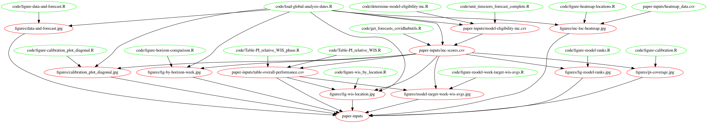

# COVID-19 Forecast Hub Model Evaluation
This repository contains code and data for forecast evaluations.

## Analysis pipeline

This analysis primarily uses R. Most of the products (figures and data tables) for an ongoing research project should be available by using the `makefile` document in the root directory of this repository.

The main file with computed scores in it can be found in `paper-inputs/inc-scores.csv`. To build this file requires the [`covidHubUtils`](https://github.com/reichlab/covidHubUtils) and the [`covidData`](https://github.com/reichlab/coviddata) R packages.

Figures for an ongoing analysis can be found in `figures/`.

The graphical depiction of the dependency structure between data and code files looks like this:
